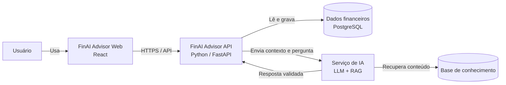

# Arquitetura

## Visão geral

O FinAI Advisor é uma aplicação de assessoria financeira pessoal com IA. Usuários registram e consultam dados financeiros, acompanham análises e metas, e interagem com um assistente que responde com base nos dados autorizados e em uma base de conhecimento confiável.

## Stack

| Camada | Tecnologia |
| --- | --- |
| Frontend | React |
| Backend | Python e FastAPI |
| Banco de dados | PostgreSQL |

## C4 simplificado

